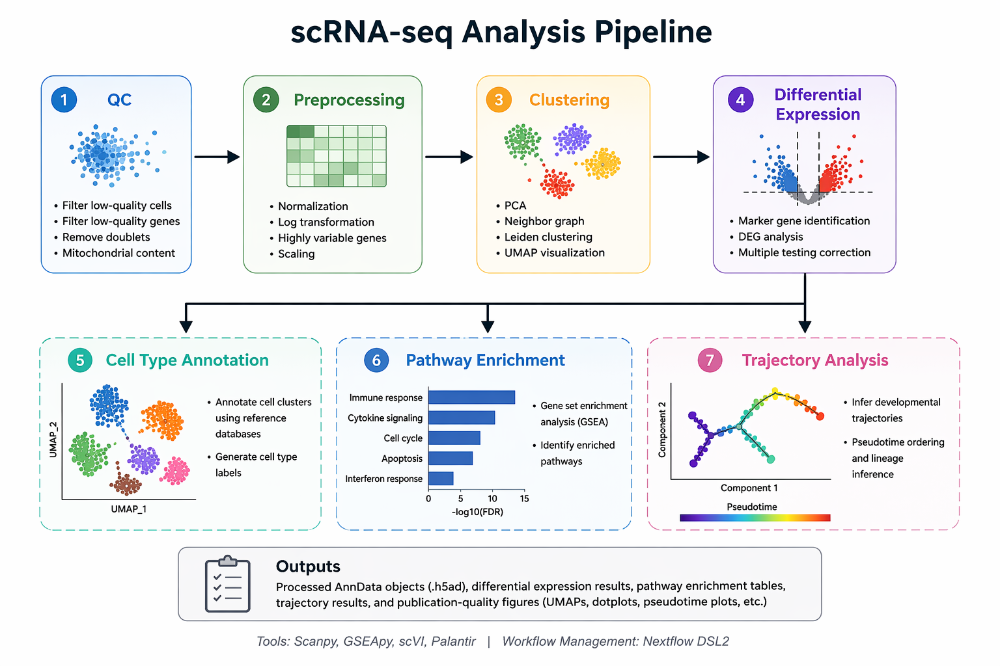

# scRNA-seq Analysis Pipeline (Nextflow DSL2)

## Overview

This repository provides a reproducible and scalable pipeline for **single-cell RNA sequencing (scRNA-seq) data analysis**, implemented using **Nextflow DSL2** and Python (Scanpy ecosystem).

The workflow performs end-to-end analysis, including quality control, preprocessing, clustering, differential expression analysis, cell type annotation, pathway enrichment, and trajectory inference.

---

## Key Features

* End-to-end scRNA-seq workflow
* Implemented using Nextflow DSL2
* Reproducible via Conda and Docker
* Modular and extensible design
* Scalable across local, HPC, and cloud environments

---

## Workflow

<p align="center">
  
</p>

---

## Repository Structure

```id="q4xk6j"
.
├── main.nf
├── nextflow.config
├── scripts/
│   ├── step01_qc.py
│   ├── step02_preprocessing.py
│   ├── step03_clustering.py
│   ├── step04_deg_analysis.py
│   ├── step05_celltype_annotation.py
│   ├── step06_pathway_enrichment.py
│   └── step07_trajectory_analysis.py
├── envs/
│   ├── environment.yml
│   └── Dockerfile
├── docs/
│   └── workflow.png
├── assets/
│   └── example_outputs/
├── notebooks/
│   └── exploratory_analysis.ipynb
├── data/
│   └── README.md
├── .gitignore
└── README.md
```

---

## Installation

### Clone the repository

```bash id="zzt2qy"
git clone https://github.com/yourusername/scrna-nextflow-pipeline.git
cd scrna-nextflow-pipeline
```

### Install Nextflow

Refer to the official documentation:
https://www.nextflow.io/docs/latest/getstarted.html

---

## Running the Pipeline

### Default execution

```bash id="pxa5qc"
nextflow run main.nf
```

### Specify output directory

```bash id="9yq6l6"
nextflow run main.nf --outdir results/
```

### Run with Conda

```bash id="yt84sy"
nextflow run main.nf -profile conda
```

### Run with Docker

```bash id="qxgb9s"
docker build -t scrna-pipeline -f envs/Dockerfile .
nextflow run main.nf -profile docker
```

---

## Pipeline Steps

| Step          | Description                           |
| ------------- | ------------------------------------- |
| QC            | Filtering low-quality cells and genes |
| Preprocessing | Normalization and scaling             |
| Clustering    | PCA, UMAP, and Leiden clustering      |
| DEG           | Differential gene expression analysis |
| Annotation    | Cell type identification              |
| Pathway       | Gene set enrichment analysis          |
| Trajectory    | Pseudotime and lineage inference      |

---

## Pipeline Implementation

The workflow is implemented using modular Python scripts:

```id="vpmhu3"
scripts/
├── step01_qc.py                  # Quality control
├── step02_preprocessing.py      # Normalization and scaling
├── step03_clustering.py         # PCA, UMAP, clustering
├── step04_deg_analysis.py       # Differential expression
├── step05_celltype_annotation.py# Cell type annotation
├── step06_pathway_enrichment.py # Pathway analysis (GSEA)
└── step07_trajectory_analysis.py# Trajectory inference
```

Each script corresponds to a stage in the Nextflow pipeline.

---

## Outputs

The pipeline generates:

* Processed AnnData objects (`.h5ad`)
* Differential expression results (`.csv`)
* Pathway enrichment results
* Trajectory analysis outputs
* Visualization plots (UMAP, QC, etc.)

Example outputs are available in:

```id="j4g17d"
assets/example_outputs/
```

---

## Figures and Visualization

All primary analysis outputs are generated automatically by the pipeline.

Additional visualization scripts are available in the `scripts/` directory.

An optional notebook is provided in `notebooks/` for exploratory analysis. This is not required for pipeline execution.

---

## Reproducibility

The pipeline supports:

* Conda environments (`envs/environment.yml`)
* Docker containers (`envs/Dockerfile`)

Execution profiles are defined in `nextflow.config`.

---

## Data

Raw datasets are not included.

Users may provide their own data or use publicly available datasets such as:

* PBMC 3k (10x Genomics)
* GEO datasets

---

## Author

Kiran Kumar
Bioinformatics | Genomics | AI/ML in Biology

---

## License

MIT License
